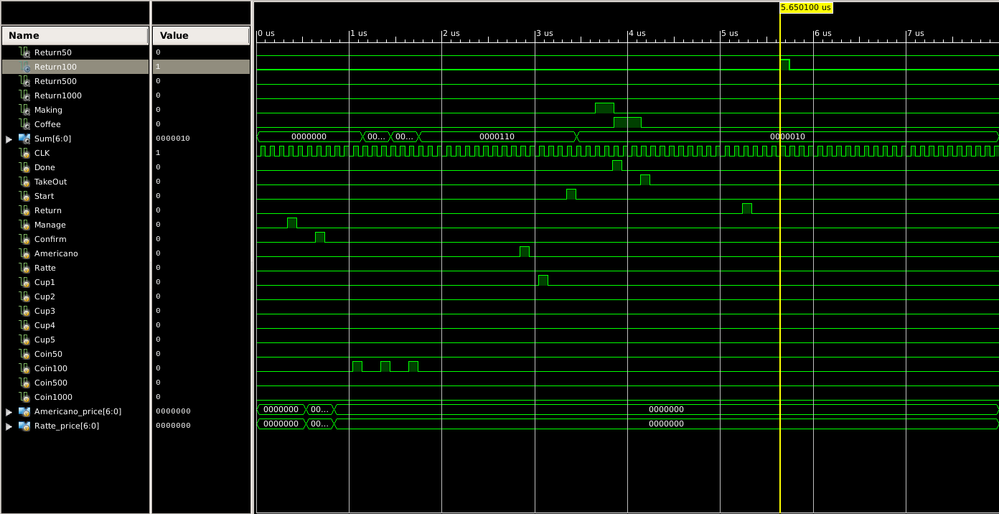

# vending-machine-verilog-
This is vending machine circuit programed with verilog 

Suggest that,

We can insert four kinds of coins each has the value 50, 100, 500 ,1000.

If sum of the value of inserted coins is overed 1000, exceeded coin is returned automatically.

And the machine can make only two kinds of coffee, Americano and Ratte.

We can select how many cups we are going to take. (1 ~ 5)

When a coffee was made, machine give us some signal that please take out the coffee. 

If we take out the coffee, then The signal that 'take out' hole is empty now is input from outside module. 

Because the time you take out coffee depends on your will.

Ordering takes a few steps.

1. select the kind of coffee.
2. select the number of cups.
3. insert coins.
4. push the 'start' button.

Whenever you want to return coins inserted, push the 'return' button.
 
And whenever you take a coffee, next coffee will be making. if it remains.

If you are the owner of the machine, you can adjust prices of coffee.

And it also takes a few steps.

1. push the 'manage' button.
2. set the prices of each coffee in binary value. if it costs 100, then it would be 2 (50 -> 1) and you'd input '10' in binary. 
3. push the 'confirm' button.

This curcit don't have authorizing logic.

So suggest that 'manage' button is locked physically. So you need a physical key for unlocking.

-------------------------------------------------------------------

**This program consists of two parts, 'Control Unit' and 'Data Path'**

**And those two parts are combined on UUT(unit under test)**

This project has above three files and a sample **Test Bench** file.

And I attached some **wave form** image result of running the **Test Bench**.

To explain,

1. set the prices of coffees. (manage -> set prices -> confirm).
In this case, Americano costs 200 (200 -> 4 -> b'100), Ratte costs 300 (300 -> 6 -> b'011).
2. insert three coins has the value 100.
3. select the kind of coffee as Americano.
4. select the number of cups as 1.
5. push the 'start' button.
6. take out an americano.
7. push the 'return' button.

